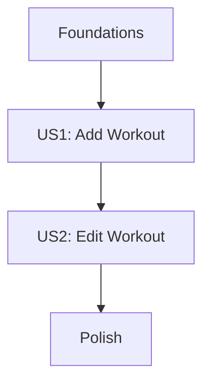

# Tasks: Workout Record Update and Navigation

**Input**: Design documents from `/specs/005-description-atualiza-de/`
**Prerequisites**: plan.md, spec.md

## Dependency Graph

## Implementation Strategy
- **MVP First**: High priority on US1 (Add) to enable basic data entry.
- **Incremental**: Implement US2 (Edit) by reusing the same result handler.
- **Verification**: Widget tests will be updated for each story to ensure UI consistency.

## Phase 1: Foundations
- [x] T001 Verify `Workout` model fields and `copyWith` method in `lib/domain/models/workout_model.dart`

## Phase 2: User Story 1 - Add a New Workout (Priority: P1)

### Story Goal
Enable users to add new workouts via FAB and see them in the list.

### Independent Test Criteria
- FAB tap navigates to form.
- Form save returns a workout.
- HomePage displays the new workout tile.

### Tasks
- [x] T002 [P] [US1] Update `test/widget/home_page_test.dart` to include a test case for adding a workout
- [x] T003 [US1] Implement `Navigator.push` in `FloatingActionButton` on `lib/presentation/pages/home_page.dart`
- [x] T004 [US1] Implement `_handleWorkoutResult(Workout? workout)` method in `home_page.dart`
- [x] T005 [US1] Add logic to `T004` to append the workout if it's new (ID not in list)
- [x] T006 [US1] Ensure `setState` is called and list is persisted (if applicable)

## Phase 3: User Story 2 - Edit an Existing Workout (Priority: P1)

### Story Goal
Enable users to edit existing workouts by tapping them in the list.

### Independent Test Criteria
- Tapping a tile navigates to form with pre-filled data.
- Form save updates the specific tile in the list.

### Tasks
- [x] T007 [P] [US2] Update `test/widget/home_page_test.dart` to include a test case for editing a workout
- [x] T008 [US2] Implement tile-tap navigation to `WorkoutFormPage` with the selected `Workout` object
- [x] T009 [US2] Update `_handleWorkoutResult` to replace the workout in the list if ID matches
- [x] T010 [US2] Verify that no duplicate tiles are created during edit

## Phase 4: Polish & Integration
- [x] T011 [P] Ensure all navigation flows handle `null` (cancel) results without errors
- [x] T012 Final visual polish of list updates (Material 3)

## Parallel Execution Examples
- **T002** (Test US1) and **T007** (Test US2) can be prepared simultaneously.
- UI implementation in `home_page.dart` (**T003**, **T008**) can be done in sequence but are logically distinct.
