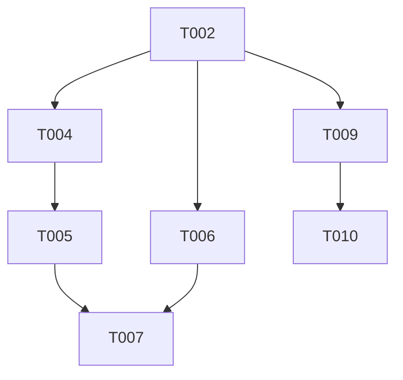

# Tasks: Auth Flow Persistence

**Input**: Design documents from `/specs/008-auth-flow-persistence/`
**Prerequisites**: plan.md (required), spec.md (required for user stories)

## Phase 1: Setup

- [x] T001 Verify project structure and `shared_preferences` dependency in `pubspec.yaml`

## Phase 2: Foundational (Auth Service)

- [x] T002 Implement `AuthService` with `isLoggedIn` and `setLoggedIn` in `lib/data/services/auth_service.dart`
- [x] T003 [P] Create unit test for `AuthService` storage logic in `test/unit/services/auth_service_test.dart`

## Phase 3: User Story 1 - Login Persistence (Priority: P1)

> **Story Goal**: Returning users skip the login screen if already authenticated.
> **Independent Test**: Start app -> Login -> Restart app -> Ensure Home Page is displayed immediately.

### Implementation
- [x] T004 [US1] Update `lib/main.dart` to await auth status and determine the `initialRoute`
- [x] T005 [US1] Update `lib/presentation/app.dart` to accept and use the `initialRoute`
- [x] T006 [US1] Update `lib/presentation/pages/login_page.dart` to call `AuthService.setLoggedIn(true)` on success
- [x] T007 [P] [US1] Create widget test for redirection flow in `test/widget/auth_redirection_test.dart`

## Phase 4: User Story 2 - Logout Functionality (Priority: P2)

> **Story Goal**: Users can securely sign out and be returned to the login screen.
> **Independent Test**: Home Page -> Click Logout -> Ensure Login Page is displayed and session is cleared.

### Implementation
- [x] T008 [US2] Add Logout icon button to the `AppBar` in `lib/presentation/pages/home_page.dart`
- [x] T009 [US2] Implement `_handleLogout` logic to clear state and redirect in `lib/presentation/pages/home_page.dart`
- [x] T010 [P] [US2] Create widget test for logout redirection in `test/widget/logout_test.dart`

## Phase 5: Polish & Validation

- [x] T011 Verify back-button behavior on Home Page (should not return to login)
- [x] T012 Ensure all Material 3 design tokens are correctly applied to the new UI elements

## Dependency Graph

## Parallel Execution Examples
- **T003 (Service Unit Test)** can be done in parallel with **Phase 3 UI changes**.
- **T007 (Redirection Widget Test)** can be done in parallel with **T010 (Logout Widget Test)** once respective logic is in place.
